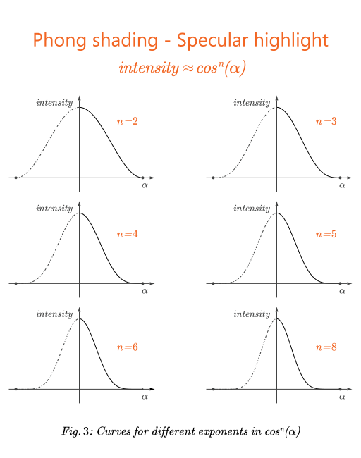

# SVGspecular - Phong shading for SVG radial gradients

[This](SVGspecular.java) is a single class program that creates an **SVG** file containing a square with a non-linear radial gradient based on Phong shading function for specular highlights (function $cos^n(angle)$). The program produces a complete standalone **SVG** file.

The **SVG** has a number of step colors $N$ determined by the user. Other parameters, such as the
exponent of Phong's function (The $n$ of $cos^n(angle)$, not $N$), can also be supplied by the user following the program name as usually done in **x** mode.

### Overall algorithm

The program takes the initial color $\vec{C_0}$ (which is generally white in the center of a the radial
gradient) and the last color $\vec{C_1}$ (which is any color to be continued outside the radial gradient),
and linearly interpolates the color $\vec{C}$ for each stop color based on a multidimensional parametric line equation, where the value of the parameter $t$ is given by the result of applying an $angle$ $\alpha$ to the function $cos^n(angle)$. In other words, this procedure is shown below:

```math
  \begin{aligned}
     &t = cos^n(\alpha)\\
     &\vec{C} = \vec{C_1}+ (\vec{C_0} - \vec{C_1}) \cdot t 
  \end{aligned}
 ```
<br>

Notice that the individual color components need to be processed independently. For simplicity and easier comprehension, the colors are dealt here as a sort of 3D (or 4D, including the alpha channel) vector representation. Indeed, colors can be represented as vectors where each color component corresponds to a different dimension.

Let's start with $\alpha=0^\circ$, and increment $\alpha$ with an angular step $\epsilon_\alpha$ at each iteration. Likewise, let's initialize the stop color offset $x$ with $x = 0$, and increment $x$ with a linear step $\epsilon$ at each iteration. In other words, the pseudocode for the overall procedure described so far is shown below:

```math
 \begin{aligned}
    &\epsilon = 1 / N\\
    &\epsilon_\alpha = 90^\circ / N\\
    &x = \alpha = 0\\
    &for\ (\,i\,\text{=}\,2; \;\; i\,\text{<}\,N; \;\; i\,\text{=}\,i\,\text{+}\,1 \,)\:\{\\
    &\quad x = x + \epsilon\\
    &\quad \alpha = \alpha + \epsilon_\alpha\\
    &\quad t = cos^n(\alpha)\\
    &\quad \vec{C} = \vec{C_1}+ (\vec{C_0} - \vec{C_1}) \cdot t\\
    &\quad \vdots\\
    &\}
  \end{aligned}
```
<br>

Notice that since the control of the loop is totally independent from the incremented variables $\alpha$ and $x$, starting the loop with $i\,\text{=}\,2$ will actually only discard the first and last stop colors $\vec{C_0}$ and $\vec{C_1}$, since they are already known in advance and don't need to be calculated.

Also notice that the names of the variables used in the pseudocode are given to enhance the algorithm comprehension and they don't correspond to the actual variable name in the [code](SVGspecular.java).

### Phong shading - Specular Highlight

Phong shading is a realistic shading algorithm for polygons in 3D scenes that calculates the color of each pixel by making the $intensity$ of light in each pixel in the polygon proportional to the dot product between the unitary vector pointing to a point light source (or the direction of a directional light source) and the polygon unitary normal vector. Since both are unitary vectors, the result of the dot product is the cosine of the angle between both vectors. Since a cosine is
a scalar, the $intensity$ is a scalar as well. This intensity is what's multiplied by the components of the pixel's color (or the components of the polygon's color, if no texture is applied) to produce the shading.

The most impressive feature of Phong's shading, though, is that it also includes an inexpensive specular highlight calculation, producing spectacular glares whenever the surface reflects the light source towards the viewer, which renders the shading tremendously realistic. For this component of the shading one needs to calculate the dot product between the unitary normal vector of the surface and the unitary vector defined by the direction between the point of the surface being shaded and the position of the observer.

As presented previously, this shading component, aka **Specular Highlight** component, is calculated through the equation:

``` math
intensity = cos^n(\alpha) 
```
<br>

For simplicity, let's forget for now where $\alpha$ comes from, assuming it is just an arbitrary angle ranging from $0^\circ$ to $90^\circ$. Let's now analyze the shape of the curve obtained when plotting a graph through the application of equation (1) to an infinite succession of angles by incrementing $\alpha$ with $\epsilon_\alpha$ such that:

``` math
\epsilon_\alpha = \lim_{\Delta\alpha\to 0}\Delta\alpha
```
<br>

The curves are shown in *Fig. 1*. The left side was artificially produced by changing the sign for negative values of $\alpha$. The intention is to complete the shapes to give a better perception how the curves narrow when the exponent increases. The higher the exponent, the shiner is the surface supposed to be.


|                                                                              |
| ------------------------------------------------------------------------------------------ |
| <center><small>*Fig. 1: Curves for different exponents in* $cos^n(angle)$</small></center> |


Notwithstanding, the effect of the specular highlight, is strikingly similar to the ones produced by radial gradients used in vector graphics. The particular interest of using this specific specular highlight calculation to calculate step colors in radial gradients is the smooth appearance of the intensity gradient that it produces. In this context, the gradient expected would be more realistic than the usually obtainable by simply making ad-hoc choices of step colors to be linear interpolated by the gradient mechanism of  the vector graphics engine being used.
