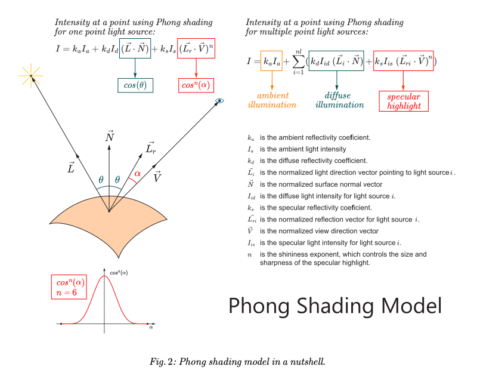

# SVGspecular - Phong shading for SVG radial gradients

[This](SVGspecular.java) is a single class program that creates an **SVG** file containing a square with a non-linear radial gradient based on Phong shading function for specular highlights (function $cos^n(angle)$​). The program produces a complete standalone **SVG** file.

The **SVG** has a number of stop colors $N$ determined by the user. Other parameters, such as the
exponent of Phong's function (the $n$ of $cos^n(angle)$, not $N$), can also be supplied by the user following the program name as usually done in **CLI** mode.

### Overall algorithm

The program takes the **initial color** $\vec{C_0}$ (which is generally white in the center of a the radial
gradient) and the **last color** $\vec{C_1}$ (which is any color to be continued outside the radial gradient),
and linearly interpolates the color $\vec{C}$ for each **stop color** based on a multidimensional parametric line equation, where the value of the parameter $t$ is given by the result of applying an $angle$ $\alpha$ to the function $cos^n(angle)$. In other words, this procedure is shown below:

```math
  \begin{aligned}
     &t = cos^n(\alpha)\\
     &\vec{C} = \vec{C_1}+ (\vec{C_0} - \vec{C_1}) \cdot t\\
     &\\
  \end{aligned}
 ```

Notice that the individual color components need to be processed independently. For simplicity and easier comprehension, the colors are dealt here as a sort of 3D (or 4D, including the alpha channel) vector representation. Indeed, colors can be represented as vectors where each color component corresponds to a different dimension.

### Complete algorithm

One can now devise the complete algorithm. A gradient in **SVG** also needs the **offset** of each stop color from the center of the gradient (considered the gradient's origin). In the algorithm it's called $x$, a variable representing the offset with values ranging from $0$ to $1$. 

Let's start with an $\alpha=0^\circ$, and then increment $\alpha$ with an angular step $\epsilon_\alpha$ at each iteration. Likewise, let's start the first stop color at $x = 0$, the center of the gradient, and increment $x$ with a linear step $\epsilon$ at each iteration. In other words, the pseudocode for the overall procedure described so far is shown in algorithm $(1)$.

```math
 \begin{aligned}
    &\epsilon = 1 / N\\
    &\epsilon_\alpha = 90^\circ / N\\
    &x = \alpha = 0\\
    &for\ (\,i\,\text{=}\,2; \;\; i\,\text{<}\,N; \;\; i\,\text{=}\,i\,\text{+}\,1 \,)\:\{\\
    &\quad x = x + \epsilon\\
    &\quad \alpha = \alpha + \epsilon_\alpha\\
    &\quad t = cos^n(\alpha)\\
    &\quad \vec{C} = \vec{C_1}+ (\vec{C_0} - \vec{C_1}) \cdot t\\
    &\}
  \end{aligned}\tag{1}
```
<br>

Notice that since the control of the loop is totally independent from the incremented variables $\alpha$ and $x$, starting the loop with $i\ \text{=}\ 2$ will have the effect of only discarding the first and last stop colors $\vec{C_0}$ and $\vec{C_1}$. This is done because these are the input colors, and since they are obviously already known in advance they don't need to be calculated.

Evidently, the algorithm above omits many details in order to simplify the logic, to show only the essential information, and to enhance comprehension. It only shows how the program calculates $\vec{C}$ and the offset $x$ for each stop color. To further contrast the algorithm from the actual [code](SVGspecular.java), the notation doesn't follow any specific language syntax either, but just borrows some similar structures from most languages.

Also of note, the names of the variables used in the pseudocode are given to enhance the algorithm comprehension and they don't correspond to the actual variable names.

### Phong shading - theoretical basis

Phong shading is a realistic shading algorithm for 3D scenes that calculates the color of each pixel by making the $intensity$ of light in each point on a surface proportional to the dot product between two unitary vectors: $\vec{L}$ and $\vec{N}$, as seen in $Fig. 1$. Vector $\vec{L}$ points to a point light source (or the direction of a directional light source), and $\vec{N}$ is the surface normal vector. Since both are unitary vectors, the result of the dot product is the cosine of the angle between both vectors. Since a cosine is a scalar, the $intensity$ is a scalar as well. When the light sources are white this intensity is what's multiplied by the components of the surface's color to produce the shading.

The most impressive feature of Phong shading, though, is that it also includes a **specular highlight** calculation, producing spectacular glares whenever the surface reflects the light source towards the viewer, which renders the shading tremendously realistic. For this component of the shading we calculate the dot product between the unitary reflected light source vector $\vec{L_r}$ and the unitary vector $\vec{V}$ pointing to the position of the observer. All vectors in Phong shading are applied to the point on the surface being shaded (see $Fig. 1$).
<p align="center">
    
</p>

Given the vectors and angles shown in $Fig. 1$, the calculation of intensity $I$ for Phong shading with a point light source is shown in formula $(2)$.
```math
\begin{align}
&I = k_aI_a + k_dI_{id}\ (\vec{L_i}\cdot\vec{N})+k_sI_{is}\ (\vec{L_{ri}}\cdot\vec{V})^n\\
&I= k_aI_a + k_dI_{id}\ cos(\theta)+k_sI_{is}\ cos^n(\alpha)
\end{align}\tag{2}
```
Where,
- $k_a$​ is the ambient reflectivity coefficient.
- $I_a$​ is the ambient light intensity.
- $k_d$​ is the diffuse reflectivity coefficient.
- $\vec{L}$​  is the normalized light direction vector pointing to the light source.
- $\vec{N}$ is the normalized surface normal vector.
- $I_{d}$ is the diffuse light intensity for the light source.
- $k_s$​ is the specular reflectivity coefficient.
- $\vec{L_{r}}$ is the normalized reflection vector for the light source.
- $\vec{V}$ is the normalized view direction vector.
- $I_{s}$ is the specular light intensity for the light source.
- $n$ is the shininess exponent, which controls the size and sharpness of the specular highlight (see $Fig. 2$ and $Fig. 3$).

The extension of Phong shading for $nl$ point light sources is shown in equation $(3)$.
```math
\begin{align}
I = k_aI_a +\sum_{i=1}^{nl} (k_dI_{id}\ (\vec{L_i}\cdot\vec{N})+k_sI_{is}\ (\vec{L_{ri}}\cdot\vec{V})^n)
\end{align} \tag{3}
```
Where,
- $\vec{L_i}$​ is the normalized light direction vector pointing to light source $i$.
- $I_{id}$ is the diffuse light intensity for light source $i$.
- $\vec{L_{ri}}$ is the normalized reflection vector for light source $i$.
- $I_{is}$ is the specular light intensity for light source $i$.

The complete model is summarized in $Fig. 2$.
<p align="center">
    
</p>

### Specular highlight

As seen in formula $(2)$ and $Fig. 3$, the specular highlight $intensity$ for a single light source is calculated by the term $k_sI_{s}\ (\vec{L_{r}}\cdot\vec{V})^n.$ Notwithstanding, since $\vec{L_{r}}$ and $\vec{V}$ are normalized, $\vec{L_{r}}\cdot\vec{V} = cos(\alpha).$ For simplicity, let's now assume $k_s = I_{s}\approx 1.$ The specular highlight $intensity$ is then given by equation $(4)$.
```math
\begin{align}
&intensity \approx cos^n(\alpha)
\end{align}\tag{4}
```
Let's forget now where $\alpha$ comes from, assuming it is just an arbitrary angle ranging from $0^\circ$ to $90^\circ$. Let's now analyze the shape of the curve obtained when plotting a graph through the application of equation $(4)$ to an infinite succession of angles by incrementing $\alpha$ with $\epsilon_\alpha$ such that:
```math
\epsilon_\alpha = \lim_{\Delta\alpha\to 0}\Delta\alpha
```
A quite precise approximation of the curves is shown in $Fig. 3$. The left side of each curve was artificially produced by changing the sign for negative values of $\alpha$. The intention is to complete the shapes to give a better perception how the curves narrow when the exponent $n$ increases. The higher the exponent, the shiner the surface is supposed to be. This corresponds to the reality since the shiner the surface is, the narrower will be the visualization of the point light source reflected on the surface.

<p align="center">  
    
</p>

### Specular highlight as a gradient

In vector graphics we observe that the effect of the specular highlight is strikingly similar to the ones produced by radial gradients. The particular interest of using Phong's specular highlight to calculate stop colors in radial gradients is the smooth appearance of the gradients intensities that it produces. In this context, the expected gradients would be more realistic than the ones usually obtainable by simply making ad-hoc choices of stop colors. To be more specific, the intensities are still linearly interpolated between each two calculated stop colors, but with a sufficient number of stop colors the transitions are imperceptible.

### Results

In $Fig. 4$ we apply algorithm $(1)$ to generate the stop colors of the gradients. Each gradient corresponds to a different exponent $n$. The gradients are presented in the same order and with the same exponents as the corresponding highlight curves of $cos^n(\alpha)$ in $Fig. 3.$ 

<p align="center">
    
</p>

We generated the gradients of $Fig. 4$, calling each time our [SVGspecular.java](SVGspecularCode.md) program with a different value of $n$ passed as an argument. After that we copied and pasted by hand each resulting gradient definition with its path into a [file](phong_gradients-org.svg), formally grouping them with \<g> and \</g>, and changing each id and url from GRAD1 (the default name for a gradient in the program) to GRAD2, GRAD3, GRAD4, GRAD5, GRAD6, and GRAD8, respectively. Then we added an appropriate translation to each group to position them according to the layout shown in the figure. Finally we edited the file on Illustrator, added the caption, saved back to the [final file](phong-gradients.svg), and used as is in $Fig. 4.$

### Applications and future uses

One could ask oneself what is the purpose of writing a program to generate gradients in **SVG** based on specular highlights, since this effect can be generated using **SVG** filters. There are a few simple reasons for doing that:

1. The program can be modified to use other functions, instead of $cos^n(\alpha).$ Equal angular intervals don't correspond to linear variations in the offset domain. This is a problem to be adequately analyzed. A possible solution is using a polynomial function $f(x)$ with curves with similar shapes as $cos^n(\alpha),$ but  with a linear domain in $x$ (the next program in this repository will implement that).

   In any case, these implementations provide increased simplicity and versatility to generate gradients than using filters.
  
2. It allows to hack an existing classical **SVG** gradient, that is, to manually substitute it by a gradient generated by the program. It requires only substituting the stop colors by the ones calculated by the program. This is especially interesting to give a more realistic look to a specular highlights (e.g., in illustrations with realistic effects in 3D).
   
3. One can use the method in another program that calculates the real specular highlights in 3D (using point light sources) and apply the resulting gradients in a projection of the 3D objects in **SVG**. This could be done by first building a 3D model of the object using sliced parametric surfaces and sliced implicit surfaces piece by piece, then determining the pieces visible according to the point of view, and proceeding in their projections as **SVG** paths. 
   
   This is not as hard to do as one can imagine, but the process wouldn't be automatic. First, the intersection of the surfaces with the cutting planes can be done by rotating the object to align the cutting plane with the plane defined by two axes, and then designing a path using Bezier curves approaching the cutting curve in 2D. Then we rotate back the control points of the path in the 3D space. When projecting the curve, it's enough to convert the control points to the projection plane to obtain the 2D path for the SVG. Paths should be closed by the visible silhouettes of the 3D object transformed in paths. The silhouettes points can be generated automatically. Maybe the paths can also be obtained automatically (there are AI based software that do that).
   
   Finally, the highlights are simply a point (the center of the gradient) and a circle (gradient radius) transformed and projected. Obviously, the result is just an approximation of the original 3D object illumination, but it's a better and more realistic approximation that doing that in 2D from scratch. The diffuse shading can be approximated using linear gradients, for example. Cylindric surfaces, for example, can have diffuse and diffuse shading using linear gradients using Phong's complete model equation $3$ to generate the stop colors.
   
   **SVG** filters can also be used for that as well, to better approximate the complete shading equation.
